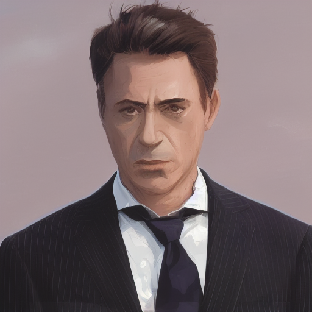
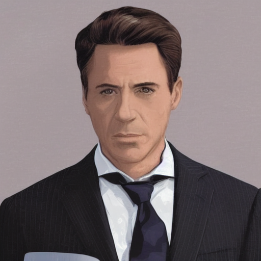
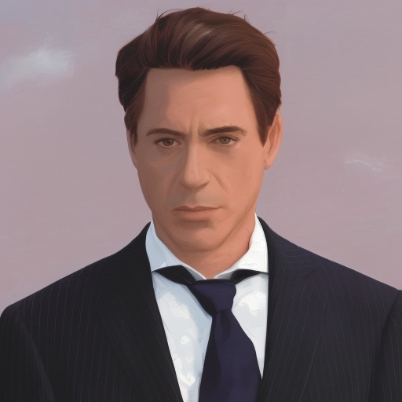
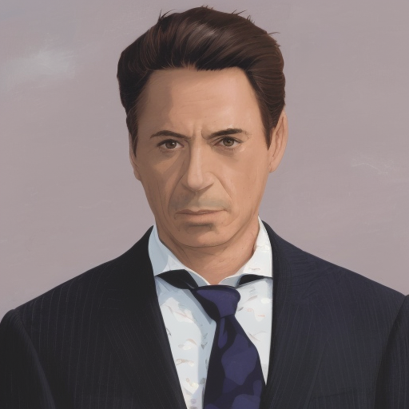

# TI2I_stylization
Text-Driven Image-to-Image Style Translation

### Step 1: Transform the input image into a noise map representation
For this you will need one of the stable diffusion base models from the [Hugging Face](https://huggingface.co) 

``python invert_image.py --pretrained_model_path path_to_your_base_model --image_path path_to_your_input_image``

### Step 2: Perform I2I translation
In addition to the stable diffusion base model, you will also need the second that was fine-tuned (usually through Dreambooth) on a specific style. You can find an example of such a model [here](https://huggingface.co/nitrosocke/Arcane-Diffusion).
**Note** that you should make sure that your second model was fine-tuned using the same version of the base stable diffusion model as the one you used for **Step 1**.

``python run_i2i.py --base_model_path path_to_your_base_model --target_model_path path_to_your_fine_tuned_model --inverted_image_path path_to_the_inverted_image --style_prompt the_unique_token_used_to_fine_tune_your_second_model --layer_swap/--alpha_blend --self_attention_layers/--resnet_block_layers``

### Some Results

  

The code was inspired from [Plug-and-Play Diffusion Features for Text-Driven Image-to-Image Translation](https://github.com/MichalGeyer/plug-and-play) and heavily depends on [diffusers](https://github.com/huggingface/diffusers)